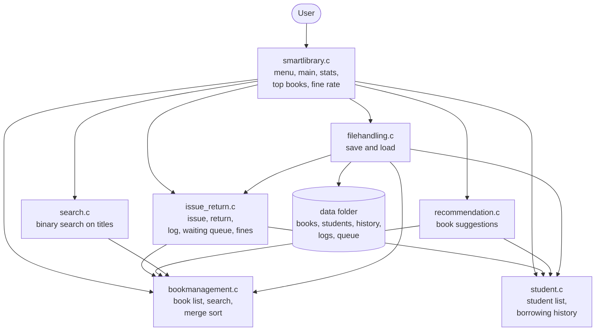
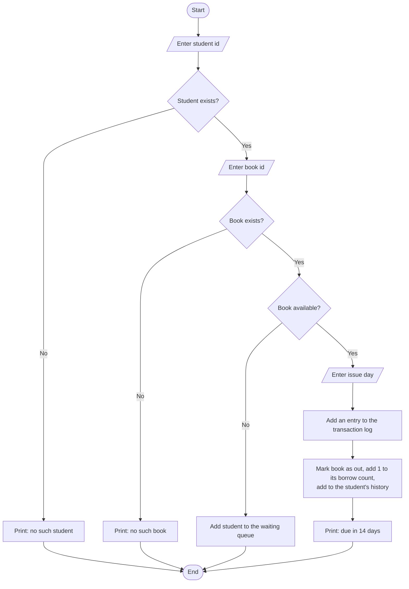
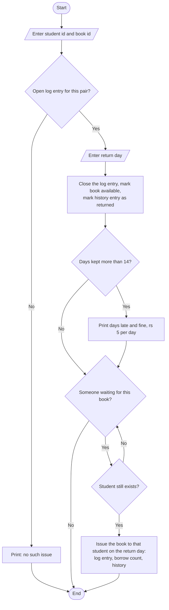
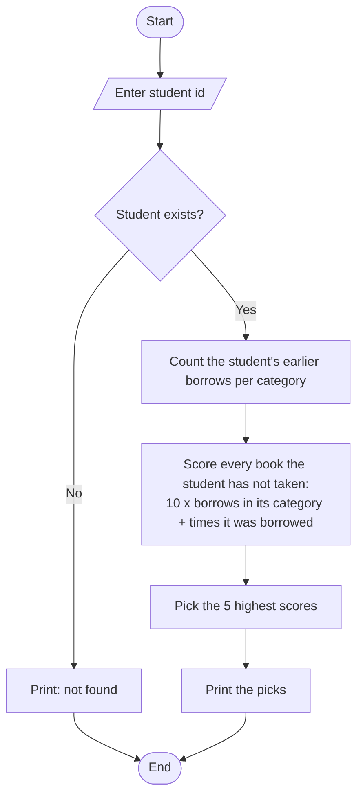

# System design

Smart Library Management and Book Recommendation System (C)

## 1. Block diagram

The menu in `smartlibrary.c` calls the other modules. All modules share the structures declared in `library.h`. `filehandling.c` saves and loads the books and students. The transaction log and the waiting queue are saved and loaded by `issue_return.c`, which `filehandling.c` calls.

## 2. Module description

| file | main functions | data structure | what it does |
|------|----------------|----------------|--------------|
| `library.h` | none (declarations) | structs `book`, `stu`, `hnode` | shared structures and function declarations used by every module |
| `bookmanagement.c` | `add_book`, `show_books`, `edit_book`, `del_book`, `find_book`, `by_id`, `find_text`, `sort_books` | singly linked list with tail pointer | keeps the book inventory; searches by title, author or category (any case, part of the text); merge sort by title, author, category or borrow count |
| `student.c` | `add_stu`, `show_stu`, `edit_stu`, `del_stu`, `find_stu`, `hist_add`, `hist_back`, `show_mine` | singly linked list of students, each with a singly linked list of borrowing history | keeps students and what each one has borrowed; shows each student's fines |
| `issue_return.c` | `issue_book`, `return_book`, `show_queue`, `fine_of`, `logs_save`, `logs_load` | singly linked list (transaction log), circular linked list (waiting queue) | issues and returns books, records every transaction, queues students for a book that is out, gives a returned book to the first student waiting, adds up fines |
| `smartlibrary.c` | `main`, `calc_fine`, `show_pop`, `stats`, `test_fine` | none of its own | menu loop, fine calculation (rs 5 per late day), top 5 books, library statistics |
| `search.c` | `bin_title` | array of book pointers | sorts by title, then binary searches for an exact title |
| `recommendation.c` | `recommend` | array of (book, score) pairs | suggests up to 5 books a student has not taken, scored by category history and popularity |
| `filehandling.c` | `save_all`, `load_all` | none | saves and loads all data as text files, one record per line |

## 3. Issue a book

If anything typed where a number is expected is not a number, the operation stops with "please enter a number" and returns to the menu.

## 4. Return a book

## 5. Recommend books

A student with no history gets the most popular books.

## 6. Data files

Every record is one line, fields separated by `|`, so titles and names can contain spaces.

| file | one line holds | example |
|------|----------------|---------|
| `data/books.txt` | id, title, author, category, available (1 or 0), borrow count | `101|C Programming|Dennis Ritchie|Programming|1|3` |
| `data/students.txt` | id, name | `1|Nimal Perera` |
| `data/history.txt` | student id, book id, returned (1 or 0) | `1|102|0` |
| `data/logs.txt` | student id, book id, issue day, return day (-1 if not returned), done (1 or 0) | `1|102|20|-1|0` |
| `data/queue.txt` | student id, book id (front of the queue first) | `2|102` |

Data is loaded when the program starts and saved when the user chooses 0 (exit) or 24 (save data).

## 7. Menu map

| choices | area |
|---------|------|
| 1 to 5 | add, show, edit, delete, find by id (books) |
| 6 to 8 | search by title, author, category |
| 9, 10, 25, 26 | sort by title, borrows, author, category |
| 11 to 14 | add, show, edit, delete (students) |
| 15, 16, 17 | issue, return, show queue |
| 18, 19, 20 | top books, statistics, fine test |
| 21 | books of one student |
| 22 | recommend books |
| 23 | binary search on title |
| 24, 0 | save data, save and exit |
